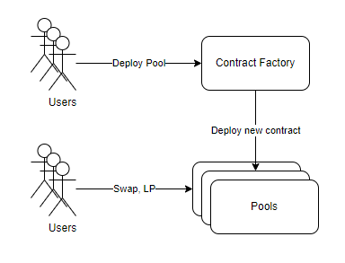
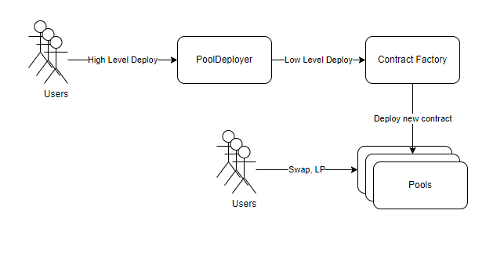
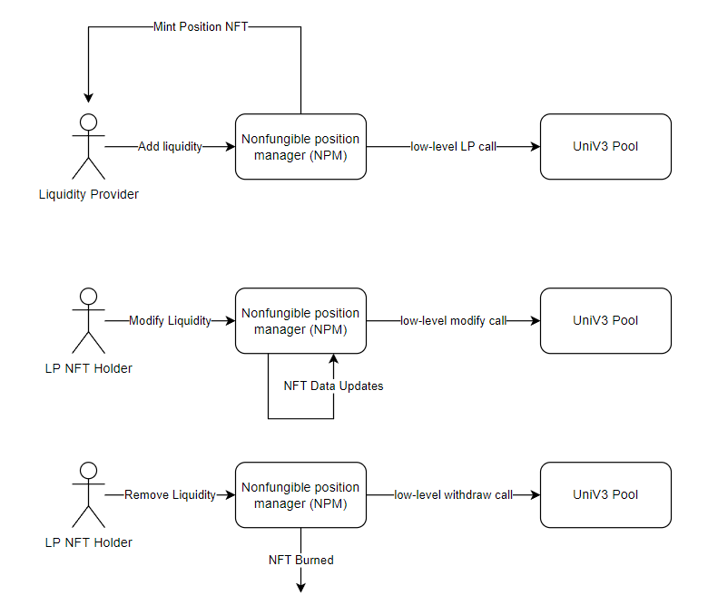
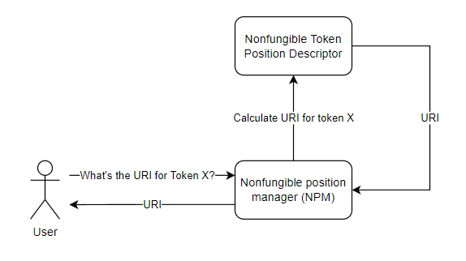
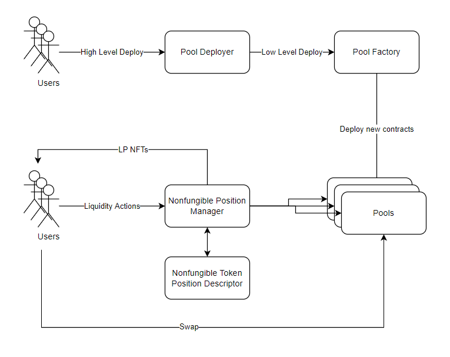
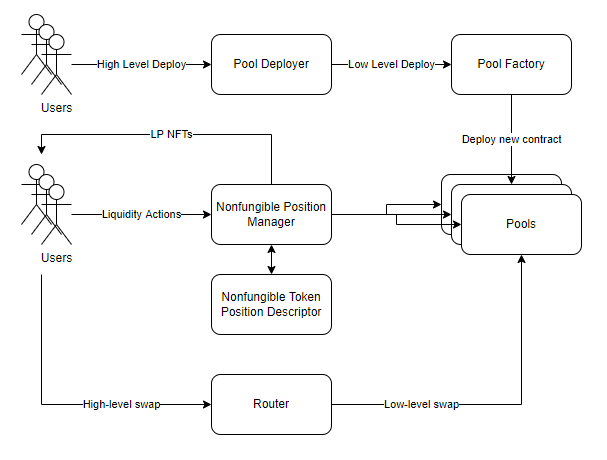
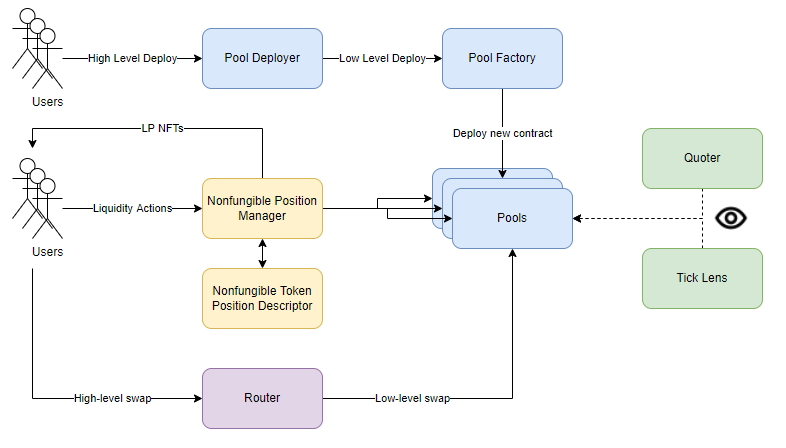
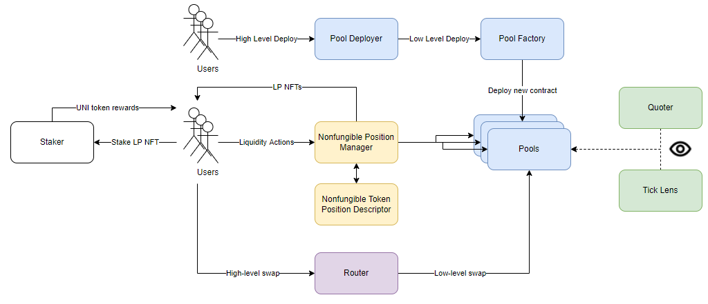
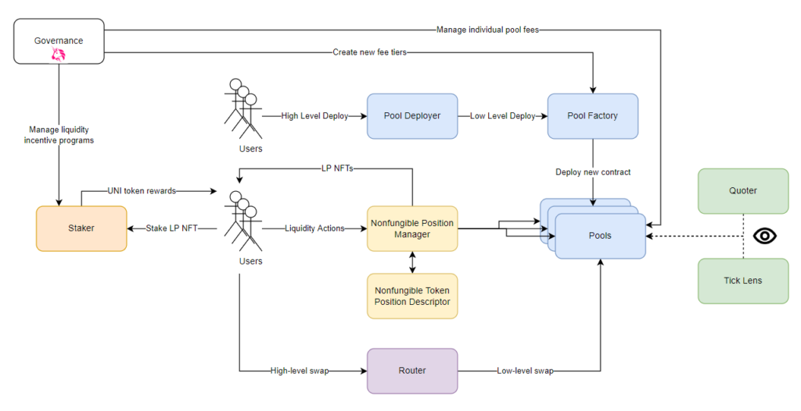

# Uniswap V3 smart contract learning and rebuild

- using solidity and foundry testing

# tips:

- Foundry package install rari-capital/solmate (no @)
  or npm i @rari-capital/solmate

# Core Contracts:

[Credit To:](https://bowtiedisland.com/concentrated-liquidity-uniswap-v3-overview/) https://bowtiedisland.com/concentrated-liquidity-uniswap-v3-overview/

- Permissionless access
- Permissionless operation
- The ability to exchange tokens

  - architectural standpoint: Contract Factory

    - Any user should be able to interact with any pool
    - Any user should be able to perform liquidity management operations on pools
    - Pools should operate indefinitely without requiring centralized inputs
    - Any user should be able to trustlessly create new pools

  - Contract factory : deploy copies of its code payload as new smart contracts. In the case of Uniswap V3, the factory’s job is to deploy shiny new Uniswap V3 pools.

  - Using a factory pattern ensures that:

    - The source code is the same for all pools
    - Each pool behaves exactly the same as any other
    - Each pool can be interacted with in exactly the same way
    - One and only one pool exists for each allowable combination

      

# Core Contracts: The Pool Deployer

This contract gives a very simple and easy way to deploy new pools with a single high-level function call.

# Periphery Contracts: Nonfungible Position Manager

1. Adding, removing, and modifying liquidity positions in any Uniswap pool
2. Representing those liquidity positions as NFTs

- When you tell the NPM to mint a new liquidity position, you pass it a group of parameters that dictate what pool to add liquidity to, how much of each token you are adding, and some slippage/MEV protection parameters such as the minimum amount of liquidity addition you will accept, and the timestamp it must be executed by. The NPM will then take care of adding the liquidity to the target pool, and mints you an NFT representing that position.

- The owner of that NFT is then the owner of the liquidity position. If you transfer the NFT, the new owner owns that liquidity position, and all its underlying token value and accrued fees. He can modify it or withdraw it at his discretion.
  

# Periphery Contracts: Token Descriptor

NFT and detail is all generated on-chain, by the Nonfungible Token Position Descriptor contract. We’ll call it the descriptor for short. To understand what it does, let’s back up for a moment and understand the idea of a token URI. The URI, or Unique Resource Identifier, is all the information attached to an NFT. Without the URI, the NFT is just a number in a contract. With the URI, it can have art, and resources, and descriptions, and properties, and all the other lovely fun stuff you can see on Opensea.

The entire data of the URI can be stored on-chain, or the token URI can just return a link to an off-chain cache containing the data. When you ask an NFT contract what the token URI for token ID #6969 is, it will retrieve or calculate the URI and pass it back to you. Your application, or Opensea, or whatever, will then parse that information and retrieve the art, generate the text, etc.

For UniV3, the complex code to generate the art and descriptive text for these cards is located in the descriptor contract. Whenever someone asks for the token URI of an LP NFT, the NPM asks the descriptor to generate the card.

That brings the total ecosystem so far up to this:

# Periphery Contracts: Router

So far, we’ve ignored the fact that there is an enormous constellation of UniV3 pools. Among these thousands of contracts, how do you find the pair you need? What if there’s not a pair for your desired swap? That’s not to mention that the UniV3 design patterns require you to call the swaps from a smart contract.

For those of us who don’t want to create custom smart contracts and infrastructure to be able to ape into tokens, Uniswap has provided a way. The router contract serves as an on-chain interface point for swaps. You tell it a token, or series of tokens, to swap between, and it will handle the low-level swap calls and funds transfer to make it all happen.

# Periphery Contracts: Lenses

UniV3 also implements several utility contracts to retrieve information from pools. The term for this design pattern is a lens contract, because it helps you see the underlying data.

The Quoter works like a skeleton router. It is designed to simulate swap calls, for the purposes of retrieving the output token amounts. This contract design is gas-intensive and should not be called on-chain, but rather simulated off-chain.

The TickLens is a tool to retrieve the liquidity at every tick for a given pool. This is used to populate the liquidity depth graphs you see on the Uniswap info website.

# Periphery Contracts: Staker

If you’ve provided liquidity to a pool before, you’re probably aware that it gives you a cut of the fees in the pool. But what about liquidity mining/liquidity farming? This takes the form of a second reward, given to you by the protocol to incentivize you to provide liquidity to that pool.

UniV3 does this via a contract which lets you stake your LP NFTs: the staker. If a pool is being incentivized by Uniswap governance, the staker contract will reward you with UNI tokens when you stake that LP NFT in it.

# Governance

And finally, we come to the governance layer. The exact mechanisms of the governance system are a subject for another overview, so “governance” is going to go in its own tidy black box. What I will cover is what governance is allowed to do in this system. There are a few main privileges reserved for governance:

Creating liquidity incentive programs via the staker
Creating new fee levels for pools (ex. the creation of the 0.01% fee tier)
Adjusting the proportion of fees reserved for the protocol on individual pools
Importantly, the governance cannot set the fee of a pool (ex. they can’t set the fee to 100% of your swap and rug you). They can only adjust the proportion of the fee that goes to the protocol vs. the liquidity providers. For example, they could set the split to 10% protocol, 90% LPs, on a 0.3% fee tier pool. That means 0.03% of every swap will be allotted to Uniswap, and 0.27% will go to the LPs.

# Wrapping Up

